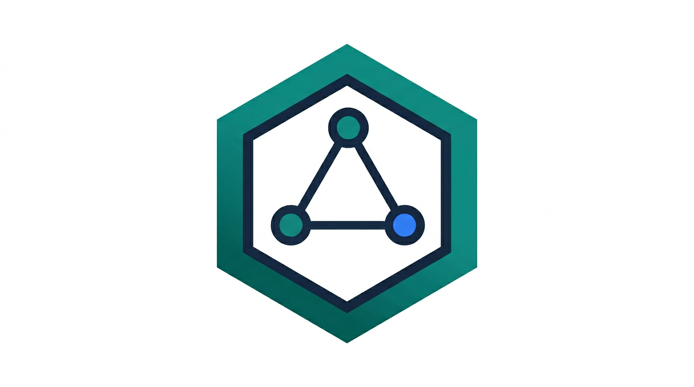
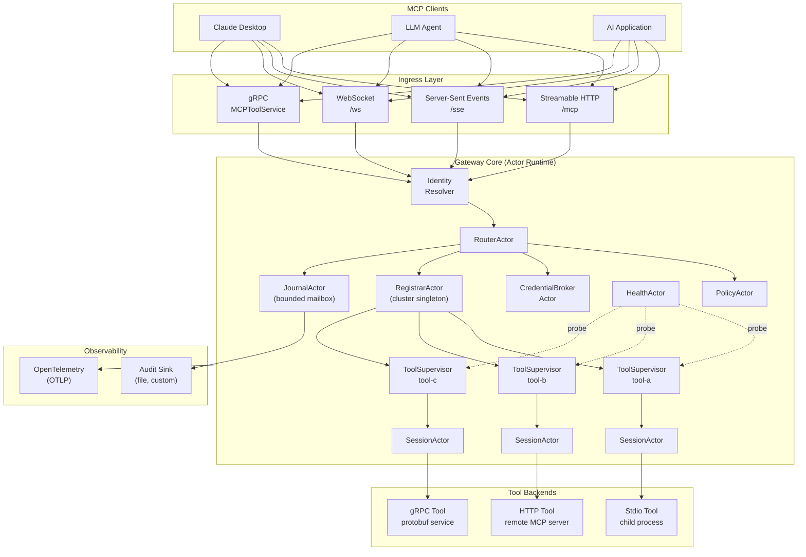
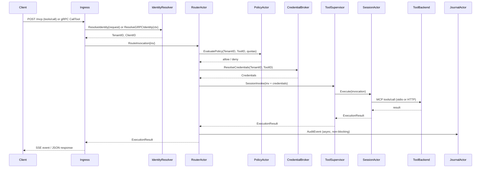
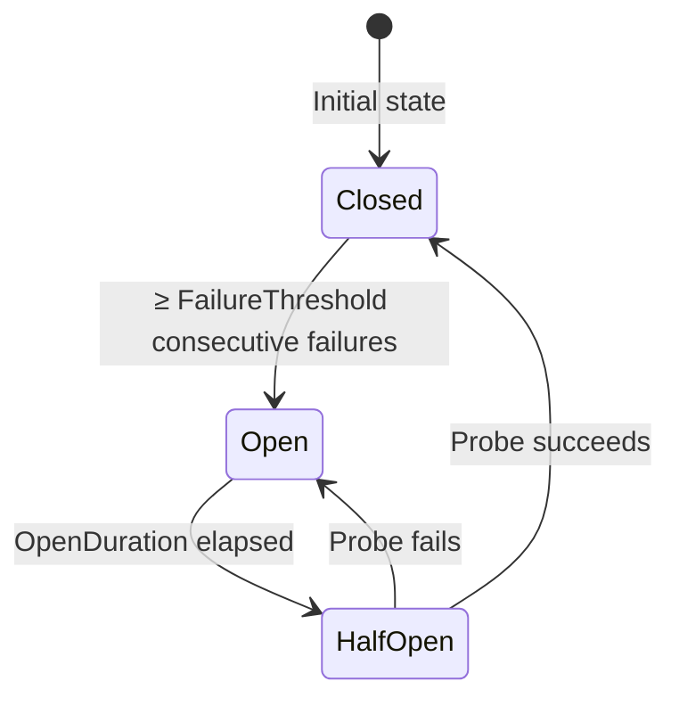
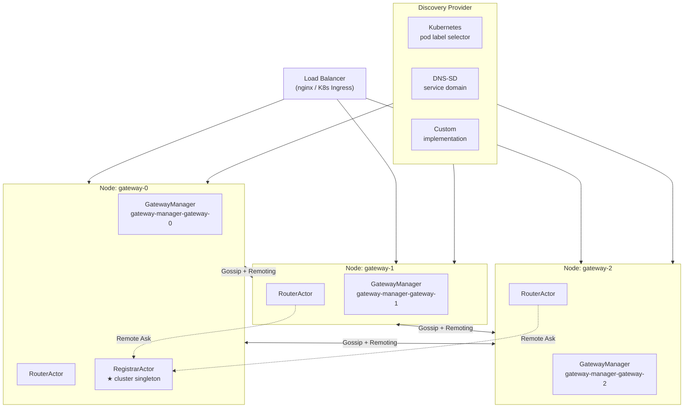

<h2 align="center">
  <br />
  Distributed MCP Gateway Library
</h2>

<p align="center">
  <a href="https://github.com/Tochemey/goakt-mcp/actions/workflows/gha-pipeline.yml"></a>
  <a href="https://codecov.io/gh/Tochemey/goakt-mcp"></a>
  <a href="https://go.dev/doc/install"></a>
  <a href="https://goreportcard.com/report/github.com/tochemey/goakt-mcp"></a>
  <a href="https://www.bestpractices.dev/projects/12179"></a>
</p>

**goakt-mcp** is a production-ready MCP (Model Context Protocol) gateway library for Go. It goes far beyond a thin JSON-RPC proxy — it is an operational control plane for MCP workloads that manages tool lifecycle, session affinity, credential brokering, policy enforcement, circuit breaking, auditing, and cluster-aware routing behind a single, clean `Gateway` API.

Built on [GoAkt](https://github.com/Tochemey/goakt), a high-performance Go actor framework, every tool, session, and control-plane concern is modelled as a supervised actor with clear lifecycle boundaries — making the system inherently resilient, observable, and scalable from a single node to a multi-node Kubernetes cluster.

## Why goakt-mcp

MCP workloads are stateful, concurrent, and failure-prone in ways that a generic HTTP proxy cannot handle well:

- **Tools are heterogeneous.** Some are local child processes over stdio; others are remote HTTP services. Their failure modes, latency profiles, and startup costs differ wildly.
- **Sessions carry state.** Sticky ownership of sessions per tenant and client is a correctness requirement, not an optimisation.
- **Tool backends fail.** Connection drops, process crashes, and slow calls are the norm. Without a supervision layer, a single tool failure silently corrupts the entire request pipeline.
- **Multi-tenancy is an operational necessity.** Rate limits, concurrency caps, and policy enforcement must be applied consistently across every invocation — not bolted on in application code.
- **Observability is not optional.** Latency, failures, circuit states, policy decisions, and audit trails are required for production operation.

The actor model is a strong fit for this problem space. Each tool has a dedicated supervisor actor. Each session has its own actor, isolated from every other session. The control plane (router, credential broker, policy engine, journal) runs as supervised actors with deterministic names, clean message boundaries, and automatic restart semantics. Failures are contained, recovery is local, and the system degrades gracefully rather than catastrophically.

## Features

- **Triple transport egress** — invoke tools over stdio (child process), HTTP (remote MCP server), or gRPC (with proto descriptor sets or server reflection)
- **Four ingress transports** — serve MCP clients via Streamable HTTP, Server-Sent Events, WebSocket, or gRPC (with streaming progress support)
- **Multi-tenancy** — per-tenant quota enforcement (rate limiting + concurrency caps) and pluggable policy evaluation
- **Credential brokering** — resolve secrets from any source (vault, env, KMS) and inject them into invocations, with a configurable LRU cache
- **Session affinity** — sticky session ownership per tenant + client + tool; or least-loaded balancing for stateless tools
- **Circuit breakers** — per-tool circuit breakers with configurable failure thresholds, open durations, and half-open probing
- **Transparent recovery** — failed sessions re-create their executor and retry automatically, without waiting for passivation
- **Health probing** — periodic health checks on every tool supervisor; circuit state transitions reflected in tool status
- **Dynamic tool management** — register, update, enable, disable, drain, and remove tools without restarting the gateway
- **Schema discovery** — automatically fetches and caches MCP tool schemas from backends at registration time
- **OpenTelemetry** — traces and metrics exported via OTLP; W3C trace-context propagated on egress
- **Durable audit trail** — every policy decision, invocation, circuit state change, and health transition is written to a pluggable `AuditSink`
- **Cluster mode** — multi-node operation with gossip membership, distributed actor messaging, cluster-singleton registrar, and pluggable peer discovery (Kubernetes, DNS-SD, or custom)
- **TLS everywhere** — optional mutual TLS for cluster remoting and tool-backend HTTP connections
- **Fully pluggable** — every operational concern (identity, policy, credentials, audit, discovery) is an interface you implement

## Architecture

goakt-mcp is structured as three layers — ingress, gateway core, and egress — connected by a supervised actor runtime.



## Core Concepts

**Gateway** is the single public entry point. It owns the actor system and provides all lifecycle and management methods. You create exactly one `Gateway` per process (or per cluster node).

**Tool** is a registered MCP backend. A tool has a unique ID, a transport type (stdio, HTTP, or gRPC), routing mode, circuit breaker configuration, credential requirements, and lifecycle state. Tools are registered at startup via `mcp.Config.Tools` or dynamically via `RegisterTool`.

**ToolSupervisor** is the actor that supervises all sessions for a single tool. It tracks the circuit breaker state, enforces `MaxSessionsPerTool` backpressure, and manages session actor lifecycle. One supervisor exists per registered tool.

**Session** is the actor that owns a single tool session for a specific tenant + client pair. It holds the `ToolExecutor` (the actual transport connection), handles invocations, and transparently recovers from transport failures. In sticky routing mode, sessions are reused across requests from the same client.

**Router** is the central dispatch actor. It receives every invocation, evaluates policy, resolves credentials, selects the appropriate tool supervisor, and routes the request to a session. It also writes to the audit journal asynchronously.

**Registrar** is the tool registry actor. It owns the authoritative list of registered tools and their supervisors. In cluster mode, it runs as a cluster-wide singleton — all nodes share a single registrar.

**Invocation** is the unit of work. It carries the tool ID, method, parameters, tenant and client identity, resolved credentials, and correlation metadata (request ID, trace ID, received timestamp).

**ExecutionResult** is the outcome. It carries the execution status (`success`, `failure`, `timeout`, `denied`, `throttled`), output map, error detail, wall-clock duration, and correlation metadata.

**Circuit Breaker** is per-tool. It transitions from `closed` (normal) → `open` (fail-fast after N consecutive failures) → `half-open` (probe with a limited request) → `closed` on recovery. The circuit state is visible via `GetToolStatus` and exported as a metric.

## Request Lifecycle

The following sequence shows the path of a `tools/call` invocation from client to backend and back.



Identity resolution happens once per MCP session (at `initialize` time) for HTTP/SSE/WebSocket transports. All subsequent requests within the session reuse the resolved identity without re-invoking the resolver. For gRPC ingress, identity is resolved on every request via `GRPCIdentityResolver` from gRPC metadata. Policy evaluation, credential resolution, and audit journaling happen on every invocation.

## Transport Support

### Ingress — serving MCP clients

goakt-mcp exposes three factory methods on `Gateway` to create ingress HTTP handlers, plus a registration method for gRPC. Mount the returned `http.Handler` in your own HTTP server or router; register the gRPC service on your own `grpc.Server`.

| Handler                       | Method             | MCP Transport         | Best for                                         |
|-------------------------------|--------------------|-----------------------|--------------------------------------------------|
| `Gateway.Handler`             | Streamable HTTP    | MCP 2025-11-25 spec   | Production clients, Claude Desktop, agents       |
| `Gateway.SSEHandler`          | Server-Sent Events | MCP 2024-11-05 spec   | Legacy clients, browser-based agents             |
| `Gateway.WSHandler`           | WebSocket          | Full-duplex streaming | Latency-sensitive, bidirectional streams         |
| `Gateway.RegisterGRPCService` | gRPC               | Protobuf/gRPC         | Service-to-service, streaming progress, polyglot |

The three HTTP handlers accept an `mcp.IngressConfig` that specifies the `IdentityResolver`, session idle timeout, and statefulness mode.

In **stateful** mode (default), each client receives a unique `Mcp-Session-Id`; the identity resolver runs once per connection and all subsequent requests reuse the resolved identity. This is the right choice for long-lived agent sessions.

In **stateless** mode (`Stateless: true`), a new session is created for every HTTP request. This works well behind load balancers where request stickiness cannot be guaranteed.

#### gRPC Ingress

The gRPC ingress exposes the `MCPToolService` protobuf service with three RPCs:

| RPC              | Description                                                                           |
|------------------|---------------------------------------------------------------------------------------|
| `ListTools`      | Returns all registered tools and their schemas                                        |
| `CallTool`       | Synchronous tool invocation — send a request, get a result                            |
| `CallToolStream` | Streaming invocation — delivers progress events as they arrive, then the final result |

Unlike the HTTP handlers (which return an `http.Handler`), gRPC services register directly on a `grpc.Server`. Identity is resolved on every request via `GRPCIdentityResolver`, which reads from gRPC metadata — the gRPC equivalent of HTTP headers.

**Server setup:**

```go
// 1. Create your gRPC server (add interceptors, TLS, etc. as needed)
grpcServer := grpc.NewServer()

// 2. Register the MCP service with your identity resolver
gw.RegisterGRPCService(grpcServer, mcp.GRPCIngressConfig{
    IdentityResolver: &myMetadataResolver{},
})

// 3. Serve
lis, _ := net.Listen("tcp", ":50051")
grpcServer.Serve(lis)
```

**Client usage (any gRPC-supported language):**

```go
conn, _ := grpc.NewClient("localhost:50051", grpc.WithTransportCredentials(insecure.NewCredentials()))
client := pb.NewMCPToolServiceClient(conn)

// Attach identity via gRPC metadata
md := metadata.Pairs("x-tenant-id", "acme", "x-client-id", "agent-1")
ctx := metadata.NewOutgoingContext(context.Background(), md)

// Discover tools
resp, _ := client.ListTools(ctx, &pb.ListToolsRequest{})

// Call a tool
args, _ := json.Marshal(map[string]any{"path": "/tmp"})
result, _ := client.CallTool(ctx, &pb.CallToolRequest{
    ToolName:  "list_directory",
    Arguments: args,
})

// Stream a tool call with progress events
stream, _ := client.CallToolStream(ctx, &pb.CallToolStreamRequest{
    ToolName:  "list_directory",
    Arguments: args,
})
for {
    msg, err := stream.Recv()
    if err == io.EOF { break }
    switch p := msg.GetPayload().(type) {
    case *pb.CallToolStreamResponse_Progress:
        log.Printf("progress: %s", p.Progress.GetMessage())
    case *pb.CallToolStreamResponse_Result:
        log.Printf("result: %v", p.Result.GetContent())
    }
}
```

Tool arguments are JSON-encoded bytes, not typed proto fields. This allows the gRPC ingress to forward arbitrary tool schemas without requiring compiled `.pb.go` types for every backend tool.

**Enterprise auth for gRPC** uses interceptors. The `GRPCAuthInterceptors` function returns unary and stream interceptors that validate Bearer tokens from the `authorization` gRPC metadata key, enforce required scopes, and store the validated token info in the context:

```go
unary, stream, _ := goaktmcp.GRPCAuthInterceptors(&mcp.EnterpriseAuthConfig{
    TokenVerifier:  myVerifier,
    RequiredScopes: []string{"tools:read"},
})
srv := grpc.NewServer(
    grpc.ChainUnaryInterceptor(unary),
    grpc.ChainStreamInterceptor(stream),
)
gw.RegisterGRPCService(srv, mcp.GRPCIngressConfig{
    EnterpriseAuth: &mcp.EnterpriseAuthConfig{
        TokenVerifier: myVerifier,
    },
    // IdentityResolver auto-installed from token claims
})
```

**Tool name caching:** By default, `CallTool` and `CallToolStream` cache the tool-name-to-ToolID mapping for 5 seconds (`DefaultToolCacheTTL`) to avoid a `ListTools` actor Ask on every request. Set `ToolCacheTTL` on `GRPCIngressConfig` to tune or disable (`-1`) the cache.

### Egress — connecting to tool backends

goakt-mcp natively supports three backend transport types.

**Stdio** launches a child process and communicates with it over stdin/stdout using the MCP protocol. This is the standard transport for locally-installed MCP servers (filesystem, shell, code interpreters, etc.). The process is supervised — if it crashes, the session actor creates a fresh process on the next invocation.

**HTTP** connects to a remote MCP server over HTTP. Full MCP Streamable HTTP semantics are used, including session management and streaming. W3C trace-context headers are propagated on every outbound call when tracing is enabled.

**gRPC** connects to a remote gRPC service using dynamic protobuf messages. Proto descriptors can be loaded from a local `.binpb` file or fetched via gRPC server reflection. JSON Schemas are derived automatically from the proto message descriptors. Server-streaming RPCs are supported via the `ToolStreamExecutor` interface.

All three transports fetch the backend's tool schemas at registration time and cache them. The gateway uses the actual tool names, descriptions, and JSON schemas to build the ingress server's tool registry, giving MCP clients accurate, discoverable schema information.

## Multi-tenancy & Authorization

Every invocation is attributed to a **TenantID** and **ClientID**, resolved at session creation time by an `IdentityResolver` you provide.

### Identity Resolution

For **HTTP/SSE/WebSocket** ingress, the resolver receives the raw HTTP request:

```go
type IdentityResolver interface {
    ResolveIdentity(r *http.Request) (TenantID, ClientID, error)
}
```

Common implementations read JWT claims, API key headers, mTLS certificate subject, or custom session tokens. A non-nil error rejects the incoming session with HTTP 400. The resolver runs once per MCP session — all subsequent requests reuse the resolved identity.

For **gRPC** ingress, the resolver receives the gRPC request context:

```go
type GRPCIdentityResolver interface {
    ResolveGRPCIdentity(ctx context.Context) (TenantID, ClientID, error)
}
```

Implementations typically read from gRPC metadata via `metadata.FromIncomingContext(ctx)`. A non-nil error returns gRPC status `Unauthenticated` to the caller. Unlike the HTTP resolver, the gRPC resolver runs on every request.

### Tenant Configuration

Each tenant can be configured with independent quota and policy settings. Tenants not listed in the configuration are accepted without quota enforcement.

| Field                       | Description                                                           |
|-----------------------------|-----------------------------------------------------------------------|
| `ID`                        | Opaque string identifier — must match what `IdentityResolver` returns |
| `Quotas.RequestsPerMinute`  | Maximum invocations per minute; zero means unlimited                  |
| `Quotas.ConcurrentSessions` | Maximum live sessions at any moment; zero means unlimited             |
| `Evaluator`                 | Optional custom `PolicyEvaluator` for this tenant                     |

### Policy Enforcement

goakt-mcp applies policy checks in two layers on every invocation:

1. **Built-in checks** — rate limit, concurrency cap, and tool authorization (tenant allowlist when configured)
2. **Custom evaluator** — your `PolicyEvaluator` implementation, called only when all built-in checks pass

```go
type PolicyEvaluator interface {
    Evaluate(ctx context.Context, input PolicyInput) *RuntimeError
}
```

`PolicyInput` carries the `TenantID`, `ToolID`, live session count, and requests-in-current-minute so that evaluators can make context-aware decisions. Return `nil` to allow, or a `*RuntimeError` with `ErrCodePolicyDenied` to deny. Common patterns include OPA integration, attribute-based access control (ABAC), and environment-specific allow-lists.

Every policy decision — allow or deny — is recorded in the audit journal.

## Credential Brokering

Some tool backends require authentication secrets (API keys, tokens, certificates). goakt-mcp's credential broker resolves secrets on behalf of sessions and injects them into every invocation, keeping secrets out of application code and request parameters.

```go
type CredentialsProvider interface {
    ID() string
    ResolveCredentials(ctx context.Context, tenantID TenantID, toolID ToolID) (*Credentials, error)
}
```

Multiple providers can be registered. The broker tries each provider in order and returns the first non-nil result. Resolved credentials are cached in a configurable LRU cache (TTL and max-entries both tunable) to avoid repeated secret store round-trips on the hot path.

Credentials are scoped to a tenant + tool pair. This means different tenants can have different credentials for the same tool, and a single tenant can have different credentials for different tools.

The `CredentialPolicy` field on each tool controls whether credentials are `optional` (proceed with empty credentials if resolution fails) or `required` (fail the invocation if resolution fails).

## Resilience

### Circuit Breakers

Every tool has an independent circuit breaker that protects the rest of the system from a misbehaving backend. Circuit state is tracked by the `ToolSupervisor` actor and transitions automatically.



| Parameter             | Default | Description                                        |
|-----------------------|---------|----------------------------------------------------|
| `FailureThreshold`    | 5       | Consecutive failures before opening                |
| `OpenDuration`        | 30 s    | Time the circuit stays open before probing         |
| `HalfOpenMaxRequests` | 1       | Maximum concurrent requests during half-open probe |

When the circuit is open, invocations fail immediately with `ErrCodeToolUnavailable` without contacting the backend. This prevents cascading failures across tenants sharing the same tool.

The `ResetCircuit` admin method closes an open circuit manually, enabling immediate recovery after an operator confirms the backend is healthy.

### Session Executor Recovery

When a session actor detects a transport failure — either a non-nil Go error from `ToolExecutor.Execute` or a result with `ErrCodeTransportFailure` — it transparently attempts recovery:

1. The failed executor is closed
2. A fresh executor is created via the `ExecutorFactory`
3. The invocation is retried once with a fresh timeout context
4. If recovery fails, the original error is returned and the circuit breaker is incremented

This means a stdio process crash or HTTP connection drop is recovered within the same request, without requiring session passivation, recreation, or client retry.

### Backpressure

The `MaxSessionsPerTool` field on a tool definition sets a hard cap on concurrent sessions. When the limit is reached, new invocations receive `ErrCodeConcurrencyLimitReached` immediately. This prevents a single overloaded tool from starving shared resources.

The audit journal actor uses a **bounded mailbox** with configurable capacity (`AuditConfig.MailboxSize`). When the mailbox is full, senders block until space is available. This provides natural backpressure on the audit path without dropping events.

### Health Probing

The `HealthActor` periodically probes every `ToolSupervisor` to check whether its tool is responsive. Probe results drive the tool's operational `State` field:

| State         | Meaning                                               |
|---------------|-------------------------------------------------------|
| `enabled`     | Tool is healthy and accepting requests                |
| `degraded`    | Tool is responding slowly or with intermittent errors |
| `unavailable` | Tool is unreachable; circuit may be open              |
| `disabled`    | Tool has been administratively disabled               |

Health state transitions are recorded in the audit journal and exported as metrics.

## Observability

### OpenTelemetry Metrics

Enable metrics with the `WithMetrics()` option. Metrics are exported via OTLP to the endpoint configured in `mcp.Config.Telemetry.OTLPEndpoint`.

| Metric              | Type      | Description                                                        |
|---------------------|-----------|--------------------------------------------------------------------|
| Invocation latency  | Histogram | End-to-end duration per tool                                       |
| Invocation failures | Counter   | Failed invocations, tagged by tool and error code                  |
| Tool state          | Gauge     | Operational state per tool (enabled/degraded/unavailable/disabled) |
| Circuit state       | Gauge     | Circuit breaker state per tool (closed/open/half-open)             |
| Session lifecycle   | Counter   | Session creation and termination events                            |
| Health transitions  | Counter   | Tool health state changes                                          |

### Distributed Tracing

Enable tracing with the `WithTracing()` option. Traces are created for every invocation and span the full path from ingress to egress. W3C `traceparent` and `tracestate` headers are propagated on all outbound HTTP calls to tool backends, enabling end-to-end distributed traces across your entire AI tool stack.

### Structured Logging

goakt-mcp uses a pluggable logging interface. You can provide your own logging backend (zap, zerolog, slog, logrus, etc.) via `WithLogger(logger)`, or set a log level declaratively via `mcp.Config.LogLevel`.

```go
type Logger interface {
    Debug(msg string, args ...any)
    Info(msg string, args ...any)
    Warn(msg string, args ...any)
    Error(msg string, args ...any)
}
```

All log lines include structured correlation fields: tenant ID, tool ID, request ID, and trace ID. If your `Logger` also implements the optional `LeveledLogger` interface (`Level() string`), the adapter uses it for engine-side log gating; otherwise it defaults to `info`.

### Durable Audit Trail

The audit journal captures every significant event as a structured `AuditEvent` and writes it to your `AuditSink` implementation asynchronously.

```go
type AuditSink interface {
    Write(event *AuditEvent) error
    Close() error
}
```

| Event Type             | Captured when                                            |
|------------------------|----------------------------------------------------------|
| `policy_decision`      | Any invocation reaches policy evaluation (allow or deny) |
| `invocation_start`     | An invocation begins executing against a tool backend    |
| `invocation_complete`  | An invocation completes successfully                     |
| `invocation_failed`    | An invocation fails (timeout, transport error, etc.)     |
| `health_transition`    | A tool's operational state changes                       |
| `circuit_state_change` | A circuit breaker transitions between states             |

Each event carries the tenant ID, client ID, tool ID, request ID, trace ID, outcome, error code, and a freeform metadata map. Built-in sinks include `MemorySink` (for testing) and `FileSink` (NDJSON line-delimited file). Custom sinks can write to any durable store — Postgres, Kafka, BigQuery, S3, etc.

## Cluster Mode

goakt-mcp supports multi-node operation. When cluster mode is enabled, gateway nodes form a peer cluster using gossip-based membership and GoAkt remoting for distributed actor communication.



### How it works

- Every node runs its own `GatewayManager` with a hostname-suffixed name (`gateway-manager-<hostname>`) so that spawning multiple nodes never triggers a cluster-wide name collision.
- The `RegistrarActor` (tool registry) runs as a **cluster singleton** — exactly one instance exists across the entire cluster, elected on whichever node starts first. Nodes that do not host the singleton reach it via GoAkt's distributed actor messaging.
- `RouterActor` runs locally on every node. It resolves the singleton registrar by name and routes invocations to local or remote supervisors transparently.
- Tool sessions and supervisors run where the registrar places them. In current topology, they are local to the singleton node; cluster-aware routing is an evolution path.

### Peers Discovery

Implement the `DiscoveryProvider` interface to control how nodes find each other.

```go
type DiscoveryProvider interface {
    ID() string
    Start(ctx context.Context) error
    DiscoverPeers(ctx context.Context) ([]string, error)
    Stop(ctx context.Context) error
}
```

`DiscoverPeers` returns a list of peer addresses (host:port for the discovery port). goakt-mcp ships with two ready-made implementations:

### TLS

Set `ClusterConfig.TLS` to a `RemotingTLSConfig` to enable TLS for all remoting and cluster communication. All nodes must share the same root CA. Mutual TLS (client certificate validation) is supported.

### Cluster-aware shutdown

For clean ordered shutdown in Kubernetes, scale the StatefulSet to zero replicas before deleting it. With `podManagementPolicy: OrderedReady`, Kubernetes terminates pods in reverse ordinal order — each departing node has live peers to replicate actor state to, preventing replication errors. The [cluster example Makefile](examples/cluster/Makefile) `cluster-down` target demonstrates this pattern.

## Configuration Reference

Construct a `mcp.Config` and pass it to `goaktmcp.New`. Zero-valued fields are filled with safe defaults.

### Runtime

Controls timeouts and probe intervals for the actor runtime.

| Field                 | Default | Description                                                      |
|-----------------------|---------|------------------------------------------------------------------|
| `SessionIdleTimeout`  | 5 min   | Passivate a session actor after this period of inactivity        |
| `RequestTimeout`      | 30 s    | Maximum time for a single actor Ask (router, registrar, session) |
| `StartupTimeout`      | 10 s    | Maximum time to wait for the actor system to become ready        |
| `HealthProbeInterval` | 30 s    | How often the health actor probes tool supervisors               |
| `ShutdownTimeout`     | 30 s    | Maximum time for a graceful shutdown                             |

### Cluster

| Field               | Description                                                               |
|---------------------|---------------------------------------------------------------------------|
| `Enabled`           | Activate cluster mode                                                     |
| `DiscoveryProvider` | Required when enabled — peer discovery implementation                     |
| `DiscoveryPort`     | Port for the discovery protocol (default 3322)                            |
| `PeersPort`         | Port for the gossip memberlist protocol (default 3320)                    |
| `RemotingPort`      | Port for GoAkt actor-to-actor remoting (default 3321)                     |
| `RegistrarRole`     | Optional cluster role that pins the singleton registrar to specific nodes |
| `TLS`               | Optional `*RemotingTLSConfig` for encrypted remoting                      |

### Telemetry

| Field          | Description                                                                         |
|----------------|-------------------------------------------------------------------------------------|
| `OTLPEndpoint` | OTLP HTTP endpoint for metrics and trace export (e.g. `http://otel-collector:4318`) |

### Audit

| Field         | Default      | Description                                                                    |
|---------------|--------------|--------------------------------------------------------------------------------|
| `Sink`        | `MemorySink` | `mcp.AuditSink` implementation; use `FileSink` or a custom sink for production |
| `MailboxSize` | 1024         | Maximum in-flight audit events before senders block (backpressure)             |

### Credentials

| Field             | Default | Description                                                  |
|-------------------|---------|--------------------------------------------------------------|
| `Providers`       | —       | Ordered slice of `mcp.CredentialsProvider` implementations   |
| `CacheTTL`        | —       | How long to cache resolved credentials before re-fetching    |
| `MaxCacheEntries` | —       | Maximum cached entries; evicts least-recently-used when full |

### Tenants

| Field                       | Description                                              |
|-----------------------------|----------------------------------------------------------|
| `ID`                        | Tenant identifier — must match `IdentityResolver` output |
| `Quotas.RequestsPerMinute`  | Requests-per-minute rate limit; zero = unlimited         |
| `Quotas.ConcurrentSessions` | Concurrent session cap; zero = unlimited                 |
| `Evaluator`                 | Optional `mcp.PolicyEvaluator` for custom authorization  |

### Tool Definition

Each entry in `Config.Tools` (or a call to `RegisterTool`) accepts the following fields.

| Field                 | Description                                                                                   |
|-----------------------|-----------------------------------------------------------------------------------------------|
| `ID`                  | Unique tool identifier                                                                        |
| `Transport`           | `stdio`, `http`, or `grpc`                                                                    |
| `Stdio`               | `*StdioTransportConfig` — command, args, env, working directory                               |
| `HTTP`                | `*HTTPTransportConfig` — URL and optional TLS config                                          |
| `GRPC`                | `*GRPCTransportConfig` — target, service, method, TLS, metadata, descriptor set or reflection |
| `State`               | Initial state: `enabled` or `disabled`                                                        |
| `Routing`             | `sticky` (session affinity, default) or `least_loaded`                                        |
| `MaxSessionsPerTool`  | Backpressure limit; zero = unlimited                                                          |
| `RequestTimeout`      | Per-tool invocation timeout; overrides runtime default                                        |
| `IdleTimeout`         | Passivate idle sessions after this duration                                                   |
| `StartupTimeout`      | Timeout for executor creation                                                                 |
| `Circuit`             | `CircuitConfig` — failure threshold, open duration, half-open max requests                    |
| `CredentialPolicy`    | `optional` (default) or `required`                                                            |
| `AuthorizationPolicy` | `tenant_allowlist` to restrict tool to specific tenants                                       |

## Public API

The `Gateway` struct is the sole public entry point. All methods are safe to call concurrently from multiple goroutines.

### Lifecycle

| Method                                | Description                                                                      |
|---------------------------------------|----------------------------------------------------------------------------------|
| `New(cfg, ...opts) (*Gateway, error)` | Construct the gateway; validates config and applies options                      |
| `Start(ctx) error`                    | Start the actor system, spawn the runtime actors, and bootstrap configured tools |
| `Stop(ctx) error`                     | Gracefully drain in-flight invocations and shut down the actor system            |

### Tool Invocation

| Method                                             | Description                                                                                      |
|----------------------------------------------------|--------------------------------------------------------------------------------------------------|
| `Invoke(ctx, inv) (*ExecutionResult, error)`       | Synchronous tool execution — blocks until the backend responds or times out                      |
| `InvokeStream(ctx, inv) (*StreamingResult, error)` | Streaming execution; returns a `StreamingResult` with a `Progress` channel and a `Final` channel |

### Tool Management

| Method                                             | Description                                                                             |
|----------------------------------------------------|-----------------------------------------------------------------------------------------|
| `ListTools(ctx) ([]Tool, error)`                   | Return all registered tools with their current schemas                                  |
| `RegisterTool(ctx, tool) error`                    | Dynamically register a new tool or replace an existing one                              |
| `UpdateTool(ctx, tool) error`                      | Update a tool's metadata; the tool must exist                                           |
| `EnableTool(ctx, toolID) error`                    | Re-enable a previously disabled tool                                                    |
| `DisableTool(ctx, toolID) error`                   | Administratively disable a tool; in-flight requests complete, new requests are rejected |
| `RemoveTool(ctx, toolID) error`                    | Remove a tool from the registry entirely                                                |
| `GetToolSchema(ctx, toolID) ([]ToolSchema, error)` | Return the cached MCP schemas discovered from the backend                               |

### Admin & Operational API

These methods provide live visibility and control over a running gateway. They are safe to call while serving traffic and return immediately.

| Method                                            | Description                                                                                             |
|---------------------------------------------------|---------------------------------------------------------------------------------------------------------|
| `GetGatewayStatus(ctx) (*GatewayStatus, error)`   | Overall status: running flag, registered tool count, total active session count                         |
| `GetToolStatus(ctx, toolID) (*ToolStatus, error)` | Per-tool status: operational state, circuit state, session count, drain flag, cached schemas            |
| `ListSessions(ctx) ([]SessionInfo, error)`        | Every active session across all tools, with tool ID, tenant ID, and client ID                           |
| `DrainTool(ctx, toolID) error`                    | Stop accepting new sessions for a tool while existing sessions finish; use before disabling or removing |
| `ResetCircuit(ctx, toolID) error`                 | Manually close an open circuit breaker after confirming the backend is healthy                          |

### Ingress Handlers

| Method                                                                | Description                                                     |
|-----------------------------------------------------------------------|-----------------------------------------------------------------|
| `Handler(cfg IngressConfig) (http.Handler, error)`                    | MCP Streamable HTTP handler (2025-11-25 spec)                   |
| `SSEHandler(cfg IngressConfig) (http.Handler, error)`                 | Server-Sent Events handler (2024-11-05 spec)                    |
| `WSHandler(cfg IngressConfig, wsCfg *WSConfig) (http.Handler, error)` | WebSocket handler                                               |
| `RegisterGRPCService(srv *grpc.Server, cfg GRPCIngressConfig) error`  | Register the MCPToolService gRPC service with streaming support |
| `GRPCAuthInterceptors(ea *EnterpriseAuthConfig) (unary, stream, error)` | Bearer token auth interceptors for the gRPC ingress           |

### Options

| Option                      | Description                                                         |
|-----------------------------|---------------------------------------------------------------------|
| `WithLogger(logger Logger)` | Plug in a custom logging backend (zap, zerolog, slog, logrus, etc.) |
| `WithDebug()`               | Enable verbose debug logging from the actor engine to stdout        |
| `WithMetrics()`             | Enable OpenTelemetry metrics export                                 |
| `WithTracing()`             | Enable OpenTelemetry tracing and W3C trace-context propagation      |

## Key Interfaces

The following interfaces are the extension points for customising goakt-mcp behaviour. All are defined in the `mcp` package.

**Identity resolution (HTTP)** — called once per new HTTP/SSE/WebSocket session:
```go
type IdentityResolver interface {
    ResolveIdentity(r *http.Request) (TenantID, ClientID, error)
}
```

**Identity resolution (gRPC)** — called once per gRPC request:
```go
type GRPCIdentityResolver interface {
    ResolveGRPCIdentity(ctx context.Context) (TenantID, ClientID, error)
}
```

**Policy evaluation** — called on every invocation, after built-in checks:
```go
type PolicyEvaluator interface {
    Evaluate(ctx context.Context, input PolicyInput) *RuntimeError
}
```

**Credential resolution** — called by the credential broker per invocation:
```go
type CredentialsProvider interface {
    ID() string
    ResolveCredentials(ctx context.Context, tenantID TenantID, toolID ToolID) (*Credentials, error)
}
```

**Audit persistence** — receives every significant event:
```go
type AuditSink interface {
    Write(event *AuditEvent) error
    Close() error
}
```

**Cluster peer discovery** — returns live peer addresses for gossip and remoting:
```go
type DiscoveryProvider interface {
    ID() string
    Start(ctx context.Context) error
    DiscoverPeers(ctx context.Context) ([]string, error)
    Stop(ctx context.Context) error
}
```

**Custom tool executor** — bring your own transport:
```go
type ToolExecutor interface {
    Execute(ctx context.Context, inv *Invocation) (*ExecutionResult, error)
    Close() error
}
```

**Custom executor factory** — creates fresh executors per session:
```go
type ExecutorFactory interface {
    Create(ctx context.Context, tool Tool, credentials map[string]string) (ToolExecutor, error)
}
```

## Examples

All examples are in the [`examples/`](examples/) directory and can be run with `go run ./examples/<name>`.

| Example                               | Demonstrates                                                                                                                                                                       |
|---------------------------------------|------------------------------------------------------------------------------------------------------------------------------------------------------------------------------------|
| [filesystem](examples/filesystem)     | Minimal gateway with a stdio filesystem tool                                                                                                                                       |
| [audit-http](examples/audit-http)     | Durable file audit sink with an HTTP egress tool                                                                                                                                   |
| [ingress](examples/ingress)           | MCP Streamable HTTP ingress with header-based identity resolution                                                                                                                  |
| [ingress-grpc](examples/ingress-grpc) | gRPC ingress with metadata-based identity resolution, ListTools, CallTool, and CallToolStream                                                                                      |
| [admin](examples/admin-policy)        | Full admin API and a custom `PolicyEvaluator`                                                                                                                                      |
| [quotas](examples/quota-assess)       | Per-tenant rate limiting and concurrency enforcement                                                                                                                               |
| [full-config](examples/full-config)   | Complete configuration reference covering every field                                                                                                                              |
| [ai-hub](examples/ai-hub)             | Production-grade multi-tenant AI tool hub: stdio + HTTP egress, Streamable HTTP ingress, pluggable policy, credential broker, durable audit, OpenTelemetry, and the full admin API |
| [cluster](examples/cluster)           | Three-node Kubernetes cluster with Kubernetes peer discovery, nginx session affinity, and Jaeger tracing                                                                           |

The [ai-hub](examples/ai-hub) example is the recommended starting point for understanding how all pieces fit together in a real deployment. The [cluster](examples/cluster) example includes a complete [Makefile](examples/cluster/Makefile) and Kubernetes manifests for deploying to a local [Kind](https://kind.sigs.k8s.io/) cluster.

## Contributing

Contributions are welcome! Please read the [Contributing Guide](CONTRIBUTING.md) for details on the development workflow, code standards, testing, and pull request process.

## Installation

```bash
go get github.com/tochemey/goakt-mcp
```

goakt-mcp requires Go 1.26 or later. The `mcp` package contains all public domain types. The `goaktmcp` root package exposes the `Gateway` and its options.

## License

This project is licensed under the terms in [LICENSE](LICENSE).
```
